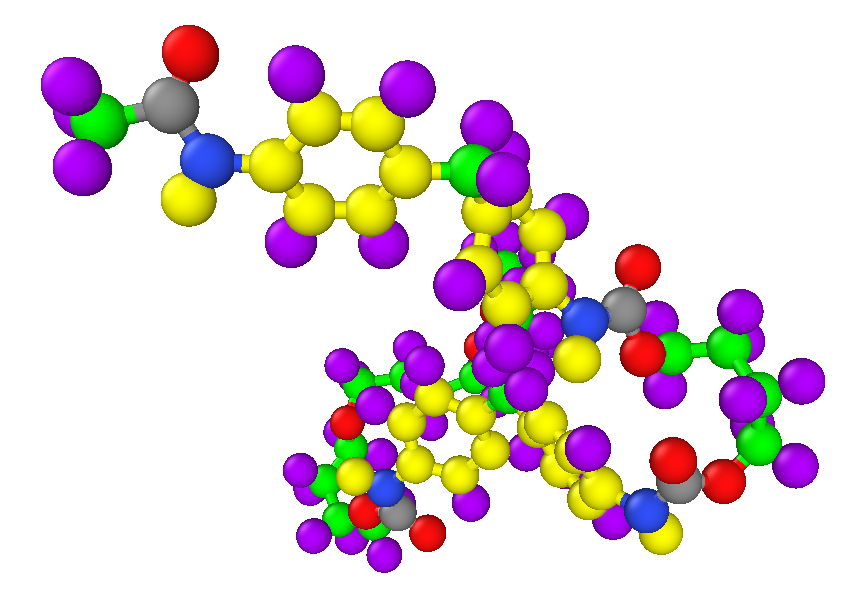
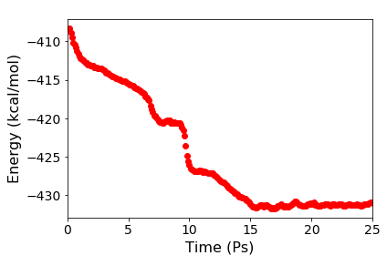

# Modelling a polyurethane chain in LAMMPS

The three files (pu_in.in, pu_data.data, pu_para.params) can be used to model a small polyurethane chain shown below. A movie of the simulation is [vaialable here](https://youtu.be/VwSrnSeHEdg).

 

The data and parameter files were created using the [Enhanced Monte Carlo Package](http://montecarlo.sourceforge.net/emc/Welcome.html) by Pieter J. in ’t Veld. The movie was created using the [Open Visualization Tool](https://www.ovito.org/).

The Python script [plot_energy.py](plot_energy.py) can be used to plot the variation of energy with time (see below):

 
